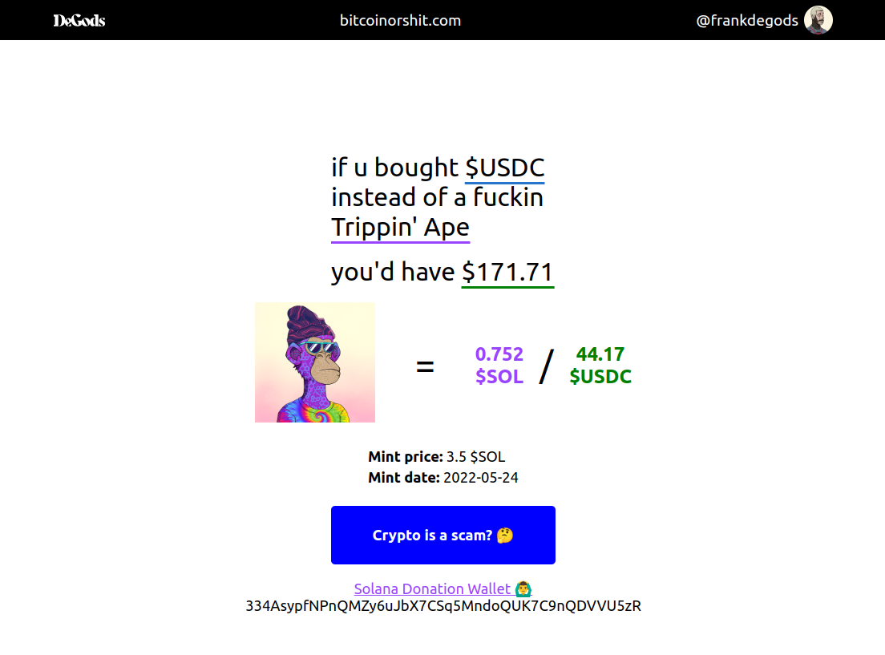

# JPEGs Or Stablecoins?

#### Video Demo: [URL HERE](INSERT_YOUR_VIDEO_URL_HERE)

#### Description:
This project, titled "JPEGs Or Stablecoins?", is a web application that emulates the functionality of one of my favorite websites, bitcoinorshit.com by frankdegods. It provides a unique comparison between the current value of various Solana NFT projects in comparison to their mint price in USD.

## Background:
The inspiration for this project stemmed from the iconic website bitcoinorshit.com, and I aimed to replicate its functionality while implementing my own touch with Solana NFT. The primary goal was to create a tool that dynamically calculates and displays the value of random NFTs in relation to the current SOL price, offering users the insight that most of them are bad long-term investments compared to their initial mint price in USD.

### Functionality:
The website fetches real-time data about the current SOL price using CoinCap API. It randomly selects and showcases details of different NFT projects, including their mint prices, floor prices, and other pertinent information.

### Project Structure:
The project is structured with HTML, CSS, and JavaScript. The HTML file defines the layout and structure of the web page, while JavaScript manages the dynamic content and interactions with external APIs.

### How to Use:
To utilize this application, simply open the `index.html` file in a web browser. Ensure an internet connection is available to fetch real-time data from external APIs.

### Frontend Skills Only:
This project has been developed solely using frontend technologies, showcasing my proficiency in HTML, CSS, and JavaScript. As a learning exercise, it highlights the capabilities of frontend development in creating interactive and informative web applications. In the future, I plan to expand my skills to include backend development and incorporate more complex features.

## Planned Features for the Future:
- **Retrieve NFT Project Data via API:** Implement a backend server to fetch NFT project data from external APIs, allowing for more extensive project information.
- **Store Projects in a Database/Backend:** Transition from a frontend object to a backend or database to manage and retrieve project data efficiently.
- **Add All-Time High (ATH) in USDC for Each NFT:** Display the highest value attained by each NFT project in USDC for better investment insights.
- **Calculate Mint Price via API:** Fetch SOL rate on the mint date of NFT projects to accurately calculate mint prices.
- **Copy Donation Wallet to Clipboard:** Implement a feature to copy the donation wallet address when clicked for ease of use.
- **Animate USDC Value Display:** Implement animated value display similar to bitcoinorshit.com for a more engaging user experience.
- **User-Generated NFT Project Suggestions:** Allow users to add or suggest NFT projects for inclusion in the application.
- **Implement ETH Projects:** Extend the application to include Ethereum-based NFT projects for a wider scope.

